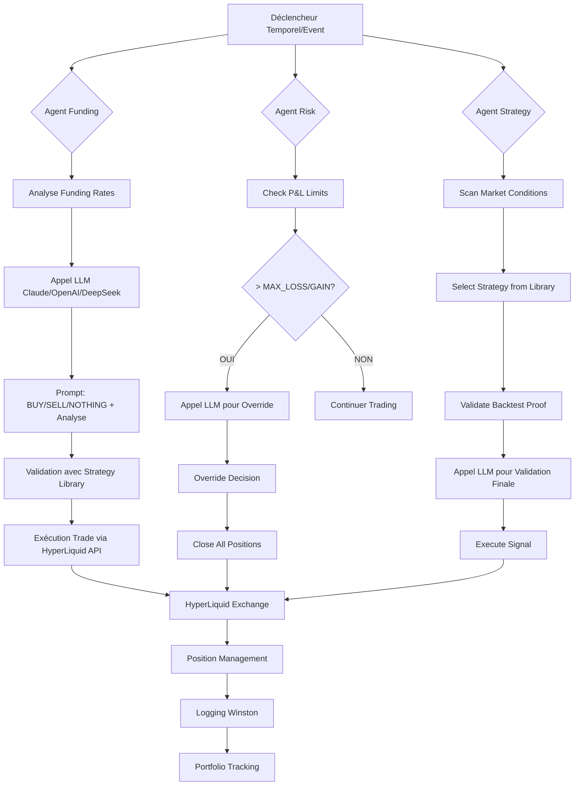

# 🧠 Graphique Technique des Agents IA - Fonctionnement Réel

## Vue d'ensemble des 3 Agents IA



## 🔄 Flux Technique Complet : De Zéro à un Ordre Vendu

### Phase 1: Initialisation & Configuration
```python
# 1. Chargement de la configuration
from src import config
AI_MODEL = config.AI_MODEL  # "glm-4.6" par défaut
EXCHANGE = "hyperliquid"

# 2. Initialisation Model Factory
from src.models import model_factory
model = model_factory.get_model("claude", config.AI_MODEL)

# 3. Connexion HyperLiquid
from src.hyperliquid import HyperliquidClient
client = HyperliquidClient()
```

### Phase 2: Agent Funding - Analyse des Taux de Financement

```python
# Agent Funding se déclenche toutes les 15 minutes
async def funding_monitoring_cycle():
    # 1. Récupération des données funding
    funding_data = api.get_funding_data()
    
    # 2. Filtrage des taux extrêmes
    extreme_rates = funding_data[
        (funding_data['annual_rate'] < -5) |
        (funding_data['annual_rate'] > 20)
    ]
    
    for token, rate in extreme_rates.items():
        # 3. Récupération des données OHLCV
        candles = await client.get_candles(token, "15m", 100)
        
        # 4. Construction du prompt IA
        prompt = FUNDING_ANALYSIS_PROMPT.format(
            symbol=token,
            rate=f"{rate:.2f}",
            market_data=format_market_data(candles),
            funding_data=funding_data.to_string()
        )
        
        # 5. Appel LLM
        response = anthropic_client.messages.create(
            model=active_model,
            max_tokens=config.AI_MAX_TOKENS,
            temperature=config.AI_TEMPERATURE,
            messages=[{"role": "user", "content": prompt}]
        )
        
        # 6. Parsing de la réponse
        action, analysis, confidence = parse_llm_response(response)
        
        # 7. Validation avec Strategy Library
        validation = validate_with_strategy_library(token, action)
        
        if validation['valid'] and confidence >= 70:
            # 8. Exécution de l'ordre
            await execute_funding_trade(token, action, confidence)
```

### Phase 3: Agent Risk - Gestion des Limites de Risque

```python
# Agent Risk check continu des limites
def check_risk_limits():
    # 1. Calcul du P&L actuel
    current_balance = get_portfolio_value()
    pnl = current_balance - start_balance
    
    # 2. Vérification des seuils
    if pnl <= -MAX_LOSS_PERCENT:
        # 3. Construction du prompt d'override IA
        prompt = RISK_OVERRIDE_PROMPT.format(
            limit_type="MAX_LOSS",
            position_data=json.dumps(current_positions)
        )
        
        # 4. Appel LLM pour décision d'override
        response = anthropic_client.messages.create(
            model=active_model,
            messages=[{"role": "user", "content": prompt}]
        )
        
        if "OVERRIDE" in response.content:
            # 5. Continuer le trading malgré la limite
            return False  # Ne pas fermer
        else:
            # 6. Fermer toutes les positions
            close_all_positions()
            return True  # Stop trading
    
    return False  # Continuer normalement
```

### Phase 4: Agent Strategy - Sélection de Stratégies

```python
# Agent Strategy - sélection basée sur backtests
def get_strategy_signal(token):
    # 1. Analyse des conditions de marché
    market_conditions = analyze_market_conditions(token)
    
    # 2. Sélection de la meilleure stratégie validée
    best_strategy = strategy_library.get_best_strategy_for_conditions(
        market_conditions, token
    )
    
    # 3. Vérification des conditions d'entrée
    if not check_strategy_conditions(best_strategy, market_conditions):
        return None
    
    # 4. Validation avec LLM
    validation_prompt = f"Validate this strategy signal: {best_strategy['name']}"
    llm_validation = anthropic_client.messages.create(
        model=active_model,
        messages=[{"role": "user", "content": validation_prompt}]
    )
    
    if "EXECUTE" in llm_validation.content:
        # 5. Exécution du signal
        return execute_strategy_signal(best_strategy, token)
    
    return None
```

## 🔗 Architecture Technique Détaillée

### Communication Inter-Agents
```
┌─────────────────┐    ┌─────────────────┐    ┌─────────────────┐
│   Agent Funding │    │   Agent Risk   │    │ Agent Strategy │
│                 │    │                 │    │                 │
│ • Funding Rates │    │ • P&L Limits    │    │ • Market Scan   │
│ • BTC Context   │    │ • Position Mgmt │    │ • Strategy Sel  │
│ • LLM Analysis  │    │ • Override Dec  │    │ • Backtest Val  │
└─────────────────┘    └─────────────────┘    └─────────────────┘
         │                        │                        │
         └────────────────────────┼────────────────────────┘
                                  │
                    ┌─────────────────┐
                    │  HyperLiquid   │
                    │     API        │
                    │                 │
                    │ • place_order() │
                    │ • get_positions │
                    │ • cancel_order │
                    └─────────────────┘
```

### Flux de Données Temps Réel
```
Market Data → Agent Analysis → LLM Validation → Strategy Library → Order Execution
     ↑              ↑              ↑              ↑              ↑
     └──────────────┴──────────────┴──────────────┴──────────────┴─────────────
                              Logging Winston
```

## 📊 Métriques de Performance

### Agent Funding
- **Fréquence**: Toutes les 15 minutes
- **Seuil d'activation**: |funding_rate| > 5% ou > 20%
- **Précision LLM**: Confidence scoring (0-100%)
- **Temps de réponse**: < 30 secondes

### Agent Risk
- **Fréquence**: Continue (check toutes les 5 minutes)
- **Limites**: % ou $ configurables
- **Override IA**: Seuils de confiance élevés
- **Action**: Close all positions si nécessaire

### Agent Strategy
- **Fréquence**: On-demand
- **Validation**: Backtest proof required
- **Library**: 50+ stratégies validées
- **LLM**: Validation finale des signaux

## 🔧 Configuration Technique

```python
# Configuration centralisée dans config.py
AI_MODEL = "glm-4.6"  # Modèle par défaut
AI_TEMPERATURE = 0.7  # Créativité vs précision
AI_MAX_TOKENS = 1024  # Longueur des réponses

# Seuils de trading
FUNDING_NEG_THRESHOLD = -5  # % annuel
FUNDING_POS_THRESHOLD = 20  # % annuel
MIN_CONFIDENCE = 70         # % pour exécution

# Limites de risque
MAX_LOSS_PERCENT = 5        # % perte max
MAX_GAIN_PERCENT = 10       # % gain max
USE_AI_OVERRIDE = True      # Autoriser override IA
```

## 🚨 Points Critiques

1. **Validation Backtest**: Aucun trade sans preuve backtest
2. **LLM comme Assistant**: IA valide, humain contrôle final
3. **Logging Complet**: Chaque décision tracée
4. **Risque Management**: Limites strictes + override IA
5. **Performance Temps Réel**: < 30s de latence max

---

*Ce graphique représente le fonctionnement technique réel du système, de l'analyse de marché à l'exécution d'ordre sur HyperLiquid.*