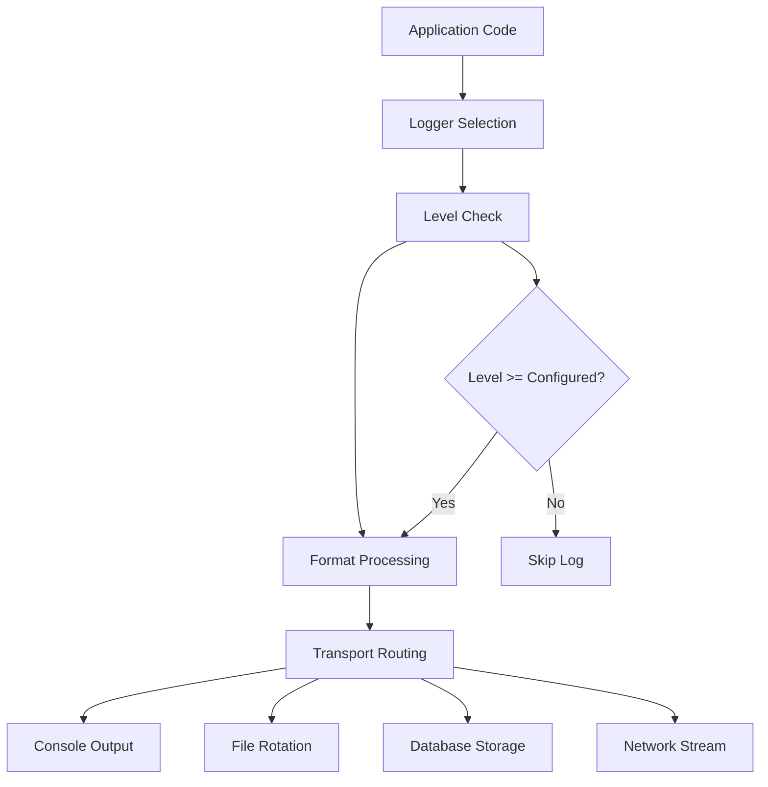

# 📚 Documentation Système de Logging - Guide Complet

## Table des matières
1. [Vue d'ensemble](#vue-densemble)
2. [Installation et configuration](#installation-et-configuration)
3. [Architecture du système](#architecture-du-système)
4. [Guide d'utilisation](#guide-dutilisation)
5. [Loggers spécialisés](#loggers-spécialisés)
6. [Configuration avancée](#configuration-avancée)
7. [Monitoring et métriques](#monitoring-et-métriques)
8. [Troubleshooting](#troubleshooting)
9. [API Reference](#api-reference)
10. [Bonnes pratiques](#bonnes-pratiques)

---

## Vue d'ensemble

Le système de logging NOVAQUOTE utilise Winston pour fournir une solution de logging robuste, structurée et performante. Il supporte 8 loggers spécialisés avec rotation automatique de fichiers et formatage JSON structuré.

### 🎯 Caractéristiques principales

```python
LOGGING_FEATURES = {
    "multi_logger_support": {
        "main": "Logger principal du système",
        "api": "Logs des appels API (novaquote-api)",
        "websocket": "Logs WebSocket (novaquote-ws)",
        "agents": "Logs des agents IA (novaquote-agents)",
        "backtests": "Logs des backtests (novaquote-backtests)",
        "trading": "Logs de trading (novaquote-trading)",
        "wallets": "Logs des wallets (novaquote-wallets)",
        "system": "Logs système généraux (novaquote-system)"
    },
    "current_implementation": {
        "services": "8 services avec identifiants uniques",
        "formatting": "Format JSON structuré",
        "rotation": "Rotation quotidienne automatique",
        "filtering": "Filtrage par niveau (info, warn, error)",
        "console_colors": "Couleurs console par niveau de log"
    },
    "transports": {
        "console": "Sortie console avec couleurs et formatage",
        "file": "Rotation automatique quotidienne avec 7-30 jours de rétention"
    },
    "performance": {
        "file_size_limit": "20MB par fichier",
        "retention": "7-30 jours selon le type de log",
        "json_formatting": "Logs structurés pour analyse"
    }
}
```

---

## Installation et configuration

### 📦 Installation des dépendances

```bash
# Installation Node.js
npm install winston
npm install winston-daily-rotate-file

# Dépendances déjà installées dans NOVAQUOTE
# - winston-daily-rotate-file pour la rotation automatique
# - winston pour le système de logging principal
```

### ⚙️ Configuration réelle

```javascript
// src/logger.js - Configuration actuelle
const winston = require('winston');
const DailyRotateFile = require('winston-daily-rotate-file');

// Configuration des transports avec rotation quotidienne
const transports = [
    // Console avec format coloré (tous les services)
    new winston.transports.Console({
        format: winston.format.combine(
            winston.format.colorize(),
            winston.format.timestamp({ format: 'YYYY-MM-DD HH:mm:ss' }),
            winston.format.printf(({ timestamp, level, message, service, ...meta }) => {
                const serviceStr = service ? `[${service}]` : '';
                const metaStr = Object.keys(meta).length ? `\n${JSON.stringify(meta, null, 2)}` : '';
                return `${timestamp} ${level} ${serviceStr} ${message}${metaStr}`;
            })
        ),
    }),

    // Logs principaux (sevice novaquaote-server uniquement)
    new DailyRotateFile({
        filename: path.join(logDir, 'app-%DATE%.log'),
        datePattern: 'YYYY-MM-DD',
        maxSize: '20m',
        maxFiles: '14d',
    }),

    // Logs d'erreurs (tous les services)
    new DailyRotateFile({
        filename: path.join(logDir, 'error-%DATE%.log'),
        datePattern: 'YYYY-MM-DD',
        level: 'error',
        maxSize: '20m',
        maxFiles: '30d',
    }),

    // Logs spécialisés par service (7 fichiers)
    new DailyRotateFile({
        filename: path.join(logDir, 'api-%DATE%.log'),
        datePattern: 'YYYY-MM-DD',
        maxSize: '20m',
        maxFiles: '7d',
    }),
    // ... autres transports spécialisés
];

// Logger principal
const logger = winston.createLogger({
    level: 'debug',
    format: winston.format.combine(
        winston.format.timestamp(),
        winston.format.errors({ stack: true }),
        winston.format.json()
    ),
    defaultMeta: { service: 'novaquote-server' },
    transports,
    exitOnError: false,
});

// Loggers spécialisés (child loggers)
const loggers = {
    api: logger.child({ service: 'novaquote-api' }),
    websocket: logger.child({ service: 'novaquote-ws' }),
    agents: logger.child({ service: 'novaquote-agents' }),
    backtests: logger.child({ service: 'novaquote-backtests' }),
    trading: logger.child({ service: 'novaquote-trading' }),
    wallets: logger.child({ service: 'novaquote-wallets' }),
    system: logger.child({ service: 'novaquote-system' }),
};
```

---

## Architecture du système

### 🏗️ Structure hiérarchique

```javascript
LOGGER_HIERARCHY = {
    "root_logger": {
        "level": "debug",
        "service": "novaquote-server",
        "purpose": "Logger principal avec tous les transports"
    },
    "child_loggers": {
        "api": "Service novaquote-api - logs des appels API",
        "websocket": "Service novaquote-ws - logs WebSocket",
        "agents": "Service novaquote-agents - logs des agents IA",
        "backtests": "Service novaquote-backtests - logs des backtests",
        "trading": "Service novaquote-trading - logs de trading",
        "wallets": "Service novaquote-wallets - logs des wallets",
        "system": "Service novaquote-system - logs système",
        "main": "Logger principal (alias du root logger)"
    },
    "file_structure": {
        "app": "Logs généraux (novaquote-server uniquement)",
        "error": "Toutes les erreurs de tous les services",
        "api": "Logs spécifiques novaquote-api",
        "websocket": "Logs spécifiques novaquote-ws",
        "agents": "Logs spécifiques novaquote-agents",
        "backtests": "Logs spécifiques novaquote-backtests",
        "trading": "Logs spécifiques novaquote-trading",
        "wallets": "Logs spécifiques novaquote-wallets",
        "system": "Logs spécifiques novaquote-system"
    },
    "implementation": "Chaque logger child partage les mêmes transports mais avec filtrage"
}
```

### 🔄 Flux de données



---

## Guide d'utilisation

### 📝 Utilisation de base

```python
# Python - Utilisation basique
import logging
from src.loggers.trading_logger import TradingLogger

# Configuration du logging
logging.basicConfig(
    level=logging.INFO,
    format='%(asctime)s [%(levelname)s] %(message)s'
)

# Utilisation d'un logger spécialisé
trading_logger = TradingLogger()

# Exemples de logs
trading_logger.info("Début de la session de trading")
trading_logger.warning("Prix proche du stop-loss", {"symbol": "BTC-PERP"})
trading_logger.error("Erreur lors de l'exécution", {"error_code": "TRD_001"})
```

```javascript
// JavaScript - Utilisation basique
const { logger } = require('./config/logging');

// Logs simples
logger.info('Application démarrée');
logger.warn('Mémoire utilisée élevée', { percentage: 85 });
logger.error('Erreur de connexion DB', { error: 'ECONNREFUSED' });

// Logs avec métadonnées
logger.info('Trade exécuté', {
    symbol: 'BTC-PERP',
    side: 'BUY',
    quantity: 1.0,
    price: 65890
});
```

### 📊 Logging trading avancé

```python
# Trading avec contexte enrichi
class AdvancedTradingLogger:
    def __init__(self):
        self.logger = TradingLogger()
    
    def log_trade_with_context(self, trade_data):
        # Enrichissement automatique du contexte
        enriched_data = {
            **trade_data,
            "timestamp": datetime.now().isoformat(),
            "session_id": self.get_session_id(),
            "user_id": self.get_user_id(),
            "strategy_version": self.get_strategy_version(),
            "market_condition": self.get_market_condition()
        }
        
        # Log avec niveau approprié selon la taille
        log_level = self.determine_log_level(trade_data['quantity'])
        log_method = getattr(self.logger, log_level.lower())
        log_method(f"TRADE: {json.dumps(enriched_data)}")
    
    def log_strategy_performance(self, strategy_name, metrics):
        performance_log = {
            "strategy": strategy_name,
            "metrics": metrics,
            "benchmark_comparison": self.get_benchmark_data(strategy_name),
            "risk_adjusted_return": self.calculate_risk_adjusted_return(metrics),
            "timestamp": datetime.now().isoformat()
        }
        
        self.logger.info(f"STRATEGY_PERFORMANCE: {json.dumps(performance_log)}")

# Utilisation
trading_logger = AdvancedTradingLogger()
trading_logger.log_trade_with_context({
    "symbol": "BTC-PERP",
    "side": "BUY", 
    "quantity": 5.0,
    "price": 65890,
    "order_id": "ORD_123456"
})
```

---

## Loggers spécialisés

### 📊 Loggers NOVAQUOTE

```javascript
// src/logger.js - Loggers spécialisés disponibles
const loggers = {
  // Logger principal
  main: logger,

  // Logger API avec contexte détaillé
  api: logger.child({ service: 'novaquote-api' }),

  // Logger WebSocket
  websocket: logger.child({ service: 'novaquote-ws' }),

  // Logger agents
  agents: logger.child({ service: 'novaquote-agents' }),

  // Logger backtests
  backtests: logger.child({ service: 'novaquote-backtests' }),

  // Logger trading
  trading: logger.child({ service: 'novaquote-trading' }),

  // Logger wallets
  wallets: logger.child({ service: 'novaquote-wallets' }),

  // Logger système
  system: logger.child({ service: 'novaquote-system' }),
};
```

### 🎯 Fonctions de logging avancées

```javascript
// Fonctions helper pour logging spécialisé
const loggingHelpers = {
  // Log d'entrée de fonction avec paramètres
  functionEntry: (loggerInstance, functionName, params = {}) => {
    loggerInstance.debug(`🚀 FUNCTION_ENTRY: ${functionName}`, {
      function: functionName,
      params,
      timestamp: new Date().toISOString(),
      entryPoint: true,
    });
  },

  // Log de performance avec métriques
  performance: (loggerInstance, operation, duration, additional = {}) => {
    const level = duration > 5000 ? 'warn' : duration > 1000 ? 'info' : 'debug';
    loggerInstance[level](`⚡ PERFORMANCE: ${operation}`, {
      operation,
      duration: `${duration}ms`,
      performanceLevel: duration > 5000 ? 'slow' : duration > 1000 ? 'medium' : 'fast',
      ...additional,
    });
  },

  // Log de requête API avec détails
  apiRequest: (loggerInstance, method, url, params = {}, startTime = null) => {
    loggerInstance.info(`📡 API_REQUEST: ${method} ${url}`, {
      method,
      url,
      params,
      timestamp: new Date().toISOString(),
      startTime: startTime ? new Date(startTime).toISOString() : null,
    });
  },

  // Log d'opérations de trading
  tradingOperation: (loggerInstance, operation, details = {}) => {
    loggerInstance.info(`💰 TRADING_${operation}`, {
      operation,
      details,
      timestamp: new Date().toISOString(),
    });
  },

  // Log d'état d'agent
  agentStatus: (loggerInstance, agentId, action, status, details = {}) => {
    loggerInstance.info(`🤖 AGENT_${action.toUpperCase()}: ${agentId}`, {
      agentId,
      action,
      status,
      details,
      timestamp: new Date().toISOString(),
    });
  },

  // Log d'erreur avec contexte
  error: (loggerInstance, message, error, context = {}) => {
    loggerInstance.error(`❌ ERROR: ${message}`, {
      error: error.message,
      stack: error.stack,
      context,
      timestamp: new Date().toISOString(),
    });
  },
};
```

### 📝 Utilisation des loggers

```javascript
// Import des loggers
const { loggers, loggingHelpers, logger } = require('./src/logger.js');

// Utilisation du logger API
loggers.api.info('API call initiated', {
  endpoint: '/api/trade',
  method: 'POST',
  timestamp: new Date().toISOString()
});

// Utilisation des helpers
loggingHelpers.apiRequest(loggers.api, 'POST', '/api/trade', { symbol: 'BTC' });
loggingHelpers.tradingOperation(loggers.trading, 'BUY', { symbol: 'ETH-PERP', amount: 5000 });
loggingHelpers.agentStatus(loggers.agents, 'trading-agent', 'START', 'running');

// Utilisation du logger d'erreurs
loggingHelpers.error(logger, 'Test error', new Error('Error message'), { context: 'test' });
```

---

## Configuration avancée

### 🔧 Configuration par environnement

```javascript
// config/logging-production.js
const winston = require('winston');
require('winston-daily-rotate-file');

const productionConfig = {
    level: 'info',
    format: winston.format.combine(
        winston.format.timestamp({
            format: 'YYYY-MM-DD HH:mm:ss'
        }),
        winston.format.errors({ stack: true }),
        winston.format.json()
    ),
    defaultMeta: { 
        service: 'novaquote',
        environment: 'production',
        version: process.env.npm_package_version 
    },
    transports: [
        // Logs erreurs uniquement en production
        new winston.transports.Console({
            level: 'warn',
            format: winston.format.combine(
                winston.format.colorize(),
                winston.format.simple()
            )
        }),
        
        // Rotation aggressive en production
        new winston.transports.DailyRotateFile({
            filename: 'logs/application-%DATE%.log',
            datePattern: 'YYYY-MM-DD',
            level: 'info',
            maxSize: '50m',
            maxFiles: '30d',
            format: winston.format.combine(
                winston.format.timestamp(),
                winston.format.json()
            )
        }),
        
        // Logs spécifiques trading avec rétention longue
        new winston.transports.DailyRotateFile({
            filename: 'logs/trading-%DATE%.log',
            datePattern: 'YYYY-MM-DD',
            level: 'info',
            maxSize: '100m',
            maxFiles: '365d',
            format: winston.format.combine(
                winston.format.timestamp(),
                winston.format.json()
            )
        })
    ],
    
    // Configuration des exceptions et rejections
    exceptionHandlers: [
        new winston.transports.DailyRotateFile({
            filename: 'logs/exceptions-%DATE%.log',
            datePattern: 'YYYY-MM-DD',
            maxSize: '50m',
            maxFiles: '90d'
        })
    ],
    
    rejectionHandlers: [
        new winston.transports.DailyRotateFile({
            filename: 'logs/rejections-%DATE%.log',
            datePattern: 'YYYY-MM-DD',
            maxSize: '50m',
            maxFiles: '90d'
        })
    ]
};

const productionLogger = winston.createLogger(productionConfig);
module.exports = productionLogger;
```

### 🎨 Configuration des couleurs et symboles

```javascript
// utils/logging-styles.js
const chalk = require('chalk');

const LOGGING_STYLES = {
    // Couleurs par niveau
    LEVEL_COLORS: {
        ERROR: chalk.red.bold,
        WARN: chalk.yellow,
        INFO: chalk.blue,
        DEBUG: chalk.green,
        TRACE: chalk.gray
    },
    
    // Symboles par service
    SERVICE_SYMBOLS: {
        trading: '📊',
        risk: '🛡️',
        api: '🌐',
        performance: '⚡',
        error: '❌',
        system: '🔧',
        security: '🔒',
        database: '💾',
        websocket: '🔌',
        agent: '🤖'
    },
    
    // Indicateurs de contexte
    CONTEXT_INDICATORS: {
        critical: '🚨',
        urgent: '⚠️',
        important: '⭐',
        success: '✅',
        failure: '❌',
        pending: '⏳',
        complete: '🏁',
        start: '🚀',
        stop: '🛑'
    },
    
    // Formatage des timestamps
    TIMESTAMP_FORMAT: 'YYYY-MM-DD HH:mm:ss.SSS',
    
    // Formatage des niveaux avec couleurs
    formatLevel: function(level) {
        const colorFn = this.LEVEL_COLORS[level] || chalk.white;
        return colorFn(`[${level}]`);
    },
    
    // Formatage des services avec symboles
    formatService: function(service) {
        const symbol = this.SERVICE_SYMBOLS[service] || '📋';
        return `${symbol} ${service}`;
    },
    
    // Formatage contextuel
    formatContext: function(context) {
        if (!context) return '';
        
        const indicator = this.CONTEXT_INDICATORS[context] || '';
        return indicator ? `${indicator} ` : '';
    }
};

module.exports = LOGGING_STYLES;
```

---

## Monitoring et métriques

### 📊 Collecte de métriques

```python
# monitoring/logging_metrics.py
import time
import psutil
import json
from datetime import datetime, timedelta
from collections import defaultdict, deque
import threading

class LoggingMetricsCollector:
    def __init__(self):
        self.metrics = {
            'logs_per_second': deque(maxlen=60),
            'memory_usage': deque(maxlen=60),
            'disk_usage': deque(maxlen=60),
            'cpu_usage': deque(maxlen=60),
            'queue_size': deque(maxlen=60),
            'error_count': defaultdict(int),
            'service_logs': defaultdict(int),
            'level_distribution': defaultdict(int)
        }
        self.start_time = time.time()
        self.last_update = time.time()
        self.running = False
        self.collection_thread = None
    
    def start_collection(self):
        """Démarre la collecte de métriques"""
        if not self.running:
            self.running = True
            self.collection_thread = threading.Thread(target=self._collect_loop)
            self.collection_thread.daemon = True
            self.collection_thread.start()
    
    def stop_collection(self):
        """Arrête la collecte de métriques"""
        self.running = False
        if self.collection_thread:
            self.collection_thread.join()
    
    def _collect_loop(self):
        """Boucle de collecte des métriques"""
        while self.running:
            self._update_system_metrics()
            self._update_log_metrics()
            time.sleep(1)
    
    def _update_system_metrics(self):
        """Met à jour les métriques système"""
        cpu_percent = psutil.cpu_percent()
        memory = psutil.virtual_memory()
        disk = psutil.disk_usage('/')
        
        self.metrics['cpu_usage'].append(cpu_percent)
        self.metrics['memory_usage'].append(memory.percent)
        self.metrics['disk_usage'].append(disk.percent)
    
    def _update_log_metrics(self):
        """Met à jour les métriques de logging"""
        # Calculer le taux de logs par seconde
        current_time = time.time()
        current_log_count = self._get_current_log_count()
        
        if hasattr(self, '_last_log_count') and hasattr(self, '_last_time'):
            time_diff = current_time - self._last_time
            count_diff = current_log_count - self._last_count
            
            if time_diff > 0:
                rate = count_diff / time_diff
                self.metrics['logs_per_second'].append(rate)
        
        self._last_log_count = current_log_count
        self._last_time = current_time
    
    def _get_current_log_count(self):
        """Obtient le nombre actuel de logs (simulation)"""
        # Dans une implémentation réelle, ceci lirait les fichiers log
        return sum(self.metrics['service_logs'].values())
    
    def get_current_metrics(self):
        """Retourne les métriques actuelles"""
        return {
            'timestamp': datetime.now().isoformat(),
            'uptime_seconds': time.time() - self.start_time,
            'real_time_metrics': {
                'logs_per_second': {
                    'current': self.metrics['logs_per_second'][-1] if self.metrics['logs_per_second'] else 0,
                    'average_60s': sum(self.metrics['logs_per_second']) / len(self.metrics['logs_per_second']) if self.metrics['logs_per_second'] else 0,
                    'peak_60s': max(self.metrics['logs_per_second']) if self.metrics['logs_per_second'] else 0
                },
                'system_usage': {
                    'cpu_percent': self.metrics['cpu_usage'][-1] if self.metrics['cpu_usage'] else 0,
                    'memory_percent': self.metrics['memory_usage'][-1] if self.metrics['memory_usage'] else 0,
                    'disk_percent': self.metrics['disk_usage'][-1] if self.metrics['disk_usage'] else 0
                }
            },
            'distribution_metrics': {
                'by_service': dict(self.metrics['service_logs']),
                'by_level': dict(self.metrics['level_distribution']),
                'errors_by_type': dict(self.metrics['error_count'])
            },
            'performance_metrics': {
                'collection_latency_ms': (time.time() - self.last_update) * 1000,
                'total_logs_processed': sum(self.metrics['service_logs'].values())
            }
        }
    
    def record_log_event(self, service, level):
        """Enregistre un événement de log"""
        self.metrics['service_logs'][service] += 1
        self.metrics['level_distribution'][level] += 1
        self.last_update = time.time()

# Instance globale du collecteur de métriques
metrics_collector = LoggingMetricsCollector()

# Fonction utilitaire pour enregistrer les logs
def record_log(service, level, message):
    metrics_collector.record_log_event(service, level)
    
    # Log dans le système respectif
    if service == 'trading':
        trading_logger.info(f"[METRICS] {message}")
    elif service == 'risk':
        risk_logger.info(f"[METRICS] {message}")
    # ... autres services

# Démarrage automatique
metrics_collector.start_collection()
```

### 📈 Dashboard de monitoring

```javascript
// frontend/logging-dashboard.js
class LoggingDashboard {
    constructor() {
        this.metrics = new Map();
        this.charts = new Map();
        this.websocket = null;
        this.updateInterval = null;
        
        this.initializeDashboard();
        this.startRealTimeUpdates();
    }
    
    initializeDashboard() {
        this.createOverviewCards();
        this.createCharts();
        this.createLogViewer();
        this.setupEventListeners();
    }
    
    createOverviewCards() {
        const container = document.getElementById('overview-cards');
        const metrics = [
            {
                title: 'Logs/Seconde',
                key: 'logs_per_second',
                unit: 'logs/sec',
                icon: '📊',
                color: 'primary',
                format: 'number'
            },
            {
                title: 'Latence Moyenne',
                key: 'average_latency_ms',
                unit: 'ms',
                icon: '⚡',
                color: 'success',
                format: 'number'
            },
            {
                title: 'Erreurs/Heure',
                key: 'errors_per_hour',
                unit: 'errors',
                icon: '❌',
                color: 'danger',
                format: 'number'
            },
            {
                title: 'Utilisation Mémoire',
                key: 'memory_usage_percent',
                unit: '%',
                icon: '💾',
                color: 'warning',
                format: 'percentage'
            }
        ];
        
        metrics.forEach(metric => {
            const card = this.createMetricCard(metric);
            container.appendChild(card);
        });
    }
    
    createMetricCard(metric) {
        const card = document.createElement('div');
        card.className = `card metric-card metric-${metric.color}`;
        card.innerHTML = `
            <div class="card-body">
                <div class="metric-header">
                    <span class="metric-icon">${metric.icon}</span>
                    <span class="metric-title">${metric.title}</span>
                    <div class="metric-sparkline" id="sparkline-${metric.key}"></div>
                </div>
                <div class="metric-value">
                    <span class="metric-number" id="metric-${metric.key}">0</span>
                    <span class="metric-unit">${metric.unit}</span>
                </div>
                <div class="metric-trend">
                    <span class="trend-icon" id="trend-icon-${metric.key}">→</span>
                    <span class="trend-text" id="trend-text-${metric.key}">Stable</span>
                </div>
            </div>
        `;
        return card;
    }
    
    createCharts() {
        // Graphique en secteurs - Distribution par niveau
        const ctx1 = document.getElementById('level-distribution-chart').getContext('2d');
        this.charts.set('levelDistribution', new Chart(ctx1, {
            type: 'doughnut',
            data: {
                labels: ['ERROR', 'WARN', 'INFO', 'DEBUG', 'TRACE'],
                datasets: [{
                    data: [0, 0, 0, 0, 0],
                    backgroundColor: [
                        '#ff4757', '#ffa502', '#2ed573', '#3742fa', '#747d8c'
                    ],
                    borderWidth: 2,
                    borderColor: '#fff'
                }]
            },
            options: {
                responsive: true,
                maintainAspectRatio: false,
                plugins: {
                    legend: {
                        position: 'bottom',
                        labels: {
                            padding: 20,
                            usePointStyle: true
                        }
                    }
                }
            }
        }));
        
        // Graphique linéaire - Évolution temporelle
        const ctx2 = document.getElementById('logstime-series-chart').getContext('2d');
        this.charts.set('logstimeSeries', new Chart(ctx2, {
            type: 'line',
            data: {
                labels: [],
                datasets: [{
                    label: 'Logs/Seconde',
                    data: [],
                    borderColor: '#3742fa',
                    backgroundColor: 'rgba(55, 66, 250, 0.1)',
                    borderWidth: 2,
                    fill: true,
                    tension: 0.4
                }, {
                    label: 'Erreurs/Seconde',
                    data: [],
                    borderColor: '#ff4757',
                    backgroundColor: 'rgba(255, 71, 87, 0.1)',
                    borderWidth: 2,
                    fill: true,
                    tension: 0.4
                }]
            },
            options: {
                responsive: true,
                maintainAspectRatio: false,
                interaction: {
                    intersect: false,
                    mode: 'index'
                },
                scales: {
                    y: {
                        beginAtZero: true,
                        grid: {
                            color: 'rgba(0, 0, 0, 0.1)'
                        }
                    },
                    x: {
                        grid: {
                            color: 'rgba(0, 0, 0, 0.1)'
                        }
                    }
                },
                plugins: {
                    legend: {
                        position: 'top'
                    }
                }
            }
        }));
    }
    
    createLogViewer() {
        const container = document.getElementById('log-viewer');
        
        // Créer l'interface de filtrage
        const filters = document.createElement('div');
        filters.className = 'log-filters';
        filters.innerHTML = `
            <div class="filter-group">
                <label>Service:</label>
                <select id="service-filter">
                    <option value="">Tous</option>
                    <option value="trading">📊 Trading</option>
                    <option value="risk">🛡️ Risk</option>
                    <option value="api">🌐 API</option>
                    <option value="performance">⚡ Performance</option>
                    <option value="error">❌ Error</option>
                    <option value="system">🔧 System</option>
                    <option value="security">🔒 Security</option>
                </select>
            </div>
            <div class="filter-group">
                <label>Niveau:</label>
                <select id="level-filter">
                    <option value="">Tous</option>
                    <option value="ERROR">ERROR</option>
                    <option value="WARN">WARN</option>
                    <option value="INFO">INFO</option>
                    <option value="DEBUG">DEBUG</option>
                </select>
            </div>
            <div class="filter-group">
                <label>Recherche:</label>
                <input type="text" id="search-input" placeholder="Rechercher...">
            </div>
        `;
        container.appendChild(filters);
        
        // Créer la zone d'affichage des logs
        const logDisplay = document.createElement('div');
        logDisplay.className = 'log-display';
        logDisplay.id = 'log-display';
        container.appendChild(logDisplay);
    }
    
    startRealTimeUpdates() {
        // WebSocket pour les mises à jour en temps réel
        this.websocket = new WebSocket('ws://localhost:7001/logs/metrics');
        
        this.websocket.onmessage = (event) => {
            const data = JSON.parse(event.data);
            this.updateMetrics(data);
            this.updateCharts(data);
        };
        
        this.websocket.onerror = (error) => {
            console.error('WebSocket error:', error);
            // Fallback vers polling
            this.startPolling();
        };
    }
    
    updateMetrics(data) {
        // Mise à jour des cartes métriques
        if (data.real_time_metrics) {
            Object.entries(data.real_time_metrics).forEach(([key, value]) => {
                this.updateMetricCard(key, value);
            });
        }
    }
    
    updateMetricCard(key, value) {
        const element = document.getElementById(`metric-${key}`);
        if (!element) return;
        
        // Formatage selon le type
        let formattedValue;
        if (key.includes('percent')) {
            formattedValue = `${value.toFixed(1)}%`;
        } else if (key.includes('latency') || key.includes('time')) {
            formattedValue = `${value.toFixed(1)}ms`;
        } else {
            formattedValue = value.toFixed(1);
        }
        
        element.textContent = formattedValue;
        
        // Mise à jour des tendances
        this.updateTrend(key, value);
    }
    
    updateTrend(key, currentValue) {
        // Logique de calcul de tendance
        const trendIcon = document.getElementById(`trend-icon-${key}`);
        const trendText = document.getElementById(`trend-text-${key}`);
        
        if (trendIcon && trendText) {
            // Comparaison avec la valeur précédente (simulation)
            const previousValue = this.previousValues?.[key] || currentValue;
            const change = ((currentValue - previousValue) / previousValue) * 100;
            
            if (Math.abs(change) < 1) {
                trendIcon.textContent = '→';
                trendText.textContent = 'Stable';
            } else if (change > 0) {
                trendIcon.textContent = '↗';
                trendText.textContent = `+${change.toFixed(1)}%`;
            } else {
                trendIcon.textContent = '↘';
                trendText.textContent = `${change.toFixed(1)}%`;
            }
        }
        
        this.previousValues = this.previousValues || {};
        this.previousValues[key] = currentValue;
    }
    
    updateCharts(data) {
        // Mise à jour du graphique de distribution
        if (data.distribution_metrics?.by_level) {
            const chart = this.charts.get('levelDistribution');
            if (chart) {
                const levels = ['ERROR', 'WARN', 'INFO', 'DEBUG', 'TRACE'];
                const values = levels.map(level => data.distribution_metrics.by_level[level] || 0);
                
                chart.data.datasets[0].data = values;
                chart.update('none');
            }
        }
        
        // Mise à jour du graphique temporel
        if (data.real_time_metrics?.logs_per_second) {
            const chart = this.charts.get('logstimeSeries');
            if (chart) {
                const now = new Date().toLocaleTimeString();
                
                chart.data.labels.push(now);
                chart.data.datasets[0].data.push(data.real_time_metrics.logs_per_second.current);
                chart.data.datasets[1].data.push(data.distribution_metrics?.by_level?.ERROR || 0);
                
                // Garder seulement les 50 dernières points
                if (chart.data.labels.length > 50) {
                    chart.data.labels.shift();
                    chart.data.datasets[0].data.shift();
                    chart.data.datasets[1].data.shift();
                }
                
                chart.update('none');
            }
        }
    }
    
    setupEventListeners() {
        // Filtres de logs
        document.getElementById('service-filter').addEventListener('change', this.filterLogs.bind(this));
        document.getElementById('level-filter').addEventListener('change', this.filterLogs.bind(this));
        document.getElementById('search-input').addEventListener('input', this.filterLogs.bind(this));
    }
    
    filterLogs() {
        const service = document.getElementById('service-filter').value;
        const level = document.getElementById('level-filter').value;
        const search = document.getElementById('search-input').value.toLowerCase();
        
        const logEntries = document.querySelectorAll('.log-entry');
        
        logEntries.forEach(entry => {
            const entryService = entry.dataset.service;
            const entryLevel = entry.dataset.level;
            const entryText = entry.textContent.toLowerCase();
            
            const serviceMatch = !service || entryService === service;
            const levelMatch = !level || entryLevel === level;
            const searchMatch = !search || entryText.includes(search);
            
            if (serviceMatch && levelMatch && searchMatch) {
                entry.style.display = 'block';
            } else {
                entry.style.display = 'none';
            }
        });
    }
}

// Initialisation du dashboard
document.addEventListener('DOMContentLoaded', () => {
    const dashboard = new LoggingDashboard();
});
```

---

## API Reference

### 🔌 Endpoints de logging

```javascript
// API Endpoints pour la gestion du logging
const LOGGING_API_ENDPOINTS = {
    // Métriques en temps réel
    'GET /api/logging/metrics': {
        description: 'Obtenir les métriques de logging en temps réel',
        response: {
            type: 'object',
            properties: {
                timestamp: { type: 'string', format: 'date-time' },
                real_time_metrics: { type: 'object' },
                distribution_metrics: { type: 'object' }
            }
        }
    },
    
    // Historique des logs
    'GET /api/logging/history': {
        description: 'Récupérer l\'historique des logs',
        query_parameters: {
            service: { type: 'string', enum: ['trading', 'risk', 'api', 'performance', 'error', 'system', 'security'] },
            level: { type: 'string', enum: ['ERROR', 'WARN', 'INFO', 'DEBUG', 'TRACE'] },
            start_date: { type: 'string', format: 'date' },
            end_date: { type: 'string', format: 'date' },
            limit: { type: 'integer', default: 1000 }
        },
        response: {
            type: 'array',
            items: {
                type: 'object',
                properties: {
                    timestamp: { type: 'string', format: 'date-time' },
                    service: { type: 'string' },
                    level: { type: 'string' },
                    message: { type: 'string' },
                    metadata: { type: 'object' }
                }
            }
        }
    },
    
    // Statistiques des logs
    'GET /api/logging/stats': {
        description: 'Obtenir les statistiques détaillées',
        response: {
            type: 'object',
            properties: {
                total_logs: { type: 'integer' },
                logs_by_service: { type: 'object' },
                logs_by_level: { type: 'object' },
                error_rate: { type: 'number' },
                average_latency: { type: 'number' }
            }
        }
    },
    
    // Configuration du logging
    'PUT /api/logging/config': {
        description: 'Mettre à jour la configuration de logging',
        body: {
            type: 'object',
            properties: {
                level: { type: 'string', enum: ['error', 'warn', 'info', 'debug', 'trace'] },
                services: { type: 'object' },
                transports: { type: 'object' }
            }
        }
    },
    
    // Nettoyage des logs
    'POST /api/logging/cleanup': {
        description: 'Nettoyer les anciens logs',
        body: {
            type: 'object',
            properties: {
                older_than_days: { type: 'integer', minimum: 1 },
                services: { type: 'array', items: { type: 'string' } }
            }
        }
    }
};
```

### 🔧 Python API Reference

```python
# python_logging_api.py
import json
import requests
from datetime import datetime, timedelta
from typing import Dict, List, Optional, Any

class PythonLoggingAPI:
    def __init__(self, base_url: str = "http://localhost:7001/api"):
        self.base_url = base_url
    
    def get_metrics(self) -> Dict[str, Any]:
        """Obtenir les métriques de logging en temps réel"""
        response = requests.get(f"{self.base_url}/logging/metrics")
        response.raise_for_status()
        return response.json()
    
    def get_history(self, 
                   service: Optional[str] = None,
                   level: Optional[str] = None,
                   start_date: Optional[datetime] = None,
                   end_date: Optional[datetime] = None,
                   limit: int = 1000) -> List[Dict[str, Any]]:
        """Récupérer l'historique des logs"""
        params = {"limit": limit}
        
        if service:
            params["service"] = service
        if level:
            params["level"] = level
        if start_date:
            params["start_date"] = start_date.isoformat()
        if end_date:
            params["end_date"] = end_date.isoformat()
        
        response = requests.get(f"{self.base_url}/logging/history", params=params)
        response.raise_for_status()
        return response.json()
    
    def get_stats(self) -> Dict[str, Any]:
        """Obtenir les statistiques détaillées"""
        response = requests.get(f"{self.base_url}/logging/stats")
        response.raise_for_status()
        return response.json()
    
    def update_config(self, config: Dict[str, Any]) -> Dict[str, Any]:
        """Mettre à jour la configuration"""
        response = requests.put(f"{self.base_url}/logging/config", json=config)
        response.raise_for_status()
        return response.json()
    
    def cleanup_logs(self, older_than_days: int, services: Optional[List[str]] = None) -> Dict[str, Any]:
        """Nettoyer les anciens logs"""
        payload = {"older_than_days": older_than_days}
        if services:
            payload["services"] = services
        
        response = requests.post(f"{self.base_url}/logging/cleanup", json=payload)
        response.raise_for_status()
        return response.json()

# Classe wrapper pour les loggers Python
class LoggingAPIClient:
    def __init__(self, api: PythonLoggingAPI):
        self.api = api
        self.metrics_cache = {}
        self.last_update = None
    
    def get_current_metrics(self, cache_duration: int = 5) -> Dict[str, Any]:
        """Obtenir les métriques avec cache"""
        now = datetime.now()
        
        if (self.last_update is None or 
            (now - self.last_update).seconds > cache_duration):
            self.metrics_cache = self.api.get_metrics()
            self.last_update = now
        
        return self.metrics_cache
    
    def monitor_performance(self, alert_thresholds: Dict[str, float]) -> List[Dict[str, Any]]:
        """Monitorer la performance avec seuils d'alerte"""
        metrics = self.get_current_metrics()
        alerts = []
        
        if "logs_per_second" in alert_thresholds:
            current_rate = metrics.get("real_time_metrics", {}).get("logs_per_second", {}).get("current", 0)
            if current_rate > alert_thresholds["logs_per_second"]:
                alerts.append({
                    "type": "HIGH_LOG_RATE",
                    "current_value": current_rate,
                    "threshold": alert_thresholds["logs_per_second"],
                    "timestamp": datetime.now().isoformat()
                })
        
        if "error_rate" in alert_thresholds:
            stats = self.api.get_stats()
            error_rate = stats.get("error_rate", 0)
            if error_rate > alert_thresholds["error_rate"]:
                alerts.append({
                    "type": "HIGH_ERROR_RATE",
                    "current_value": error_rate,
                    "threshold": alert_thresholds["error_rate"],
                    "timestamp": datetime.now().isoformat()
                })
        
        return alerts
    
    def analyze_logs_by_time_range(self, 
                                 start_time: datetime, 
                                 end_time: datetime,
                                 service: Optional[str] = None) -> Dict[str, Any]:
        """Analyser les logs dans un intervalle de temps"""
        logs = self.api.get_history(start_date=start_time, end_date=end_time, service=service)
        
        analysis = {
            "time_range": {
                "start": start_time.isoformat(),
                "end": end_time.isoformat(),
                "duration_minutes": (end_time - start_time).total_seconds() / 60
            },
            "total_logs": len(logs),
            "logs_per_minute": len(logs) / ((end_time - start_time).total_seconds() / 60),
            "service_distribution": {},
            "level_distribution": {},
            "hourly_distribution": {}
        }
        
        # Analyser la distribution par service
        for log in logs:
            service = log.get("service", "unknown")
            analysis["service_distribution"][service] = analysis["service_distribution"].get(service, 0) + 1
            
            level = log.get("level", "unknown")
            analysis["level_distribution"][level] = analysis["level_distribution"].get(level, 0) + 1
            
            # Distribution horaire
            timestamp = datetime.fromisoformat(log.get("timestamp", "").replace("Z", "+00:00"))
            hour = timestamp.hour
            analysis["hourly_distribution"][hour] = analysis["hourly_distribution"].get(hour, 0) + 1
        
        return analysis

# Utilisation
api_client = PythonLoggingAPI()
logging_api = LoggingAPIClient(api_client)

# Exemple d'utilisation
if __name__ == "__main__":
    # Obtenir les métriques actuelles
    metrics = logging_api.get_current_metrics()
    print("Métriques actuelles:", json.dumps(metrics, indent=2))
    
    # Monitoring avec alertes
    alert_thresholds = {
        "logs_per_second": 2000,
        "error_rate": 0.05
    }
    
    alerts = logging_api.monitor_performance(alert_thresholds)
    if alerts:
        print("Alertes détectées:", json.dumps(alerts, indent=2))
    
    # Analyse sur les dernières 24h
    end_time = datetime.now()
    start_time = end_time - timedelta(hours=24)
    
    analysis = logging_api.analyze_logs_by_time_range(start_time, end_time)
    print("Analyse 24h:", json.dumps(analysis, indent=2))
```

---

## Troubleshooting

### 🔧 Problèmes courants et solutions

```python
# troubleshooting/logging_troubleshooting.py

TROUBLESHOOTING_GUIDE = {
    "high_memory_usage": {
        "symptoms": ["Mémoire système élevée", "Performance dégradée", "Logs tronqués"],
        "causes": [
            "Trop de logs en mémoire",
            "Rotation de fichiers désactivée",
            "Formatage JSON volumineux"
        ],
        "solutions": [
            {
                "action": "Activer la rotation de fichiers",
                "code": """
new winston.transports.DailyRotateFile({
    filename: 'logs/app-%DATE%.log',
    maxSize: '20m',
    maxFiles: '14d'
})
                """
            },
            {
                "action": "Limiter les logs en mémoire",
                "code": """
winston.format.combine(
    winston.format((info) => {
        // Tronquer les messages trop longs
        if (info.message && info.message.length > 1000) {
            info.message = info.message.substring(0, 1000) + '...';
        }
        return info;
    })(),
    winston.format.json()
)
                """
            },
            {
                "action": "Optimiser le formatage",
                "code": """
// Éviter les objets trop volumineux dans les logs
winston.format((info) => {
    if (info.metadata && typeof info.metadata === 'object') {
        // Limiter la profondeur d'objets
        const sanitized = JSON.parse(JSON.stringify(info.metadata, (key, value) => {
            if (typeof value === 'object' && value !== null) {
                if (Object.keys(value).length > 10) {
                    return { ...value, truncated: true };
                }
            }
            return value;
        }));
        info.metadata = sanitized;
    }
    return info;
})()
                """
            }
        ]
    },
    
    "slow_logging_performance": {
        "symptoms": ["Latence élevée", "Bottlenecks applicatifs", "Logs en retard"],
        "causes": [
            "Écritures synchrones",
            "Traitement de logs volumineux",
            "Transport réseau lent"
        ],
        "solutions": [
            {
                "action": "Utiliser l'écriture asynchrone",
                "code": """
const logger = winston.createLogger({
    transports: [
        new winston.transports.File({
            filename: 'logs/app.log',
            options: { flags: 'a' } // Mode append asynchrone
        })
    ]
});
                """
            },
            {
                "action": "Implémenter un buffer de logs",
                "code": """
class LogBuffer {
    constructor(logger, bufferSize = 100) {
        this.logger = logger;
        this.buffer = [];
        this.bufferSize = bufferSize;
        this.flushInterval = setInterval(() => this.flush(), 1000);
    }
    
    log(level, message, meta = {}) {
        this.buffer.push({ level, message, meta, timestamp: new Date() });
        
        if (this.buffer.length >= this.bufferSize) {
            this.flush();
        }
    }
    
    flush() {
        while (this.buffer.length > 0) {
            const logEntry = this.buffer.shift();
            this.logger.log(logEntry.level, logEntry.message, logEntry.meta);
        }
    }
}
                """
            }
        ]
    },
    
    "log_format_issues": {
        "symptoms": ["Logs illisibles", "Perte de données", "Format incohérent"],
        "causes": [
            "Format personnalisé incorrect",
            "Encodage de caractères",
            "Conflits de format entre services"
        ],
        "solutions": [
            {
                "action": "Standardiser les formats",
                "code": """
const STANDARD_FORMAT = winston.format.combine(
    winston.format.timestamp({
        format: 'YYYY-MM-DD HH:mm:ss.SSS'
    }),
    winston.format.errors({ stack: true }),
    winston.format.printf(({ timestamp, level, message, service, ...meta }) => {
        const serviceSymbol = SERVICE_SYMBOLS[service] || '📋';
        return `${timestamp} ${serviceSymbol} [${level}]: ${message} ${Object.keys(meta).length ? JSON.stringify(meta) : ''}`;
    })
);
                """
            }
        ]
    },
    
    "missing_logs": {
        "symptoms": ["Logs manquants", "Trous dans l'historique", "Incohérences temporelles"],
        "causes": [
            "Rotation trop agressive",
            "Erreurs d'écriture",
            "Problèmes de permissions"
        ],
        "solutions": [
            {
                "action": "Vérifier les permissions",
                "code": """
import os
import stat

def check_log_permissions(log_directory):
    for filename in os.listdir(log_directory):
        filepath = os.path.join(log_directory, filename)
        if os.path.isfile(filepath):
            mode = os.stat(filepath).st_mode
            if not (mode & stat.S_IWRITE):
                print(f"Warning: {filepath} is not writable")
                os.chmod(filepath, stat.S_IWRITE | stat.S_IREAD)
                """
            },
            {
                "action": "Implémenter la validation des logs",
                "code": """
class LogValidator:
    def __init__(self, log_file_path):
        self.log_file_path = log_file_path
        self.expected_sequence = 0
    
    def validate_log_entry(self, log_entry):
        sequence = log_entry.get('sequence', 0)
        if sequence != self.expected_sequence:
            raise LogSequenceError(f"Missing log entry: expected {self.expected_sequence}, got {sequence}")
        self.expected_sequence += 1
        return True
    
    def validate_file_integrity(self):
        with open(self.log_file_path, 'r') as f:
            for line_num, line in enumerate(f, 1):
                try:
                    log_entry = json.loads(line)
                    self.validate_log_entry(log_entry)
                except json.JSONDecodeError:
                    raise InvalidLogFormat(f"Invalid JSON at line {line_num}")
                except LogSequenceError as e:
                    raise LogIntegrityError(f"Log integrity issue: {e}")
                """
            }
        ]
    }
}

class LogDiagnostics:
    def __init__(self):
        self.diagnostics = TROUBLESHOOTING_GUIDE
    
    def run_diagnostics(self):
        """Exécute une série de diagnostics"""
        results = {
            "timestamp": datetime.now().isoformat(),
            "system_info": self._get_system_info(),
            "performance_metrics": self._get_performance_metrics(),
            "log_file_analysis": self._analyze_log_files(),
            "issues_detected": [],
            "recommendations": []
        }
        
        # Détecter les problèmes
        results["issues_detected"] = self._detect_issues(results)
        
        # Générer des recommandations
        results["recommendations"] = self._generate_recommendations(results["issues_detected"])
        
        return results
    
    def _get_system_info(self):
        """Obtenir les informations système"""
        return {
            "os": os.name,
            "memory": psutil.virtual_memory()._asdict(),
            "disk": psutil.disk_usage('/')._asdict(),
            "cpu": psutil.cpu_percent(interval=1),
            "processes": len(psutil.pids())
        }
    
    def _get_performance_metrics(self):
        """Obtenir les métriques de performance"""
        return {
            "cpu_usage": psutil.cpu_percent(),
            "memory_usage": psutil.virtual_memory().percent,
            "disk_usage": psutil.disk_usage('/').percent,
            "io_stats": psutil.disk_io_counters()._asdict() if psutil.disk_io_counters() else None
        }
    
    def _analyze_log_files(self):
        """Analyser les fichiers de logs"""
        log_analysis = {}
        log_directory = "logs"
        
        if os.path.exists(log_directory):
            for filename in os.listdir(log_directory):
                if filename.endswith('.log'):
                    filepath = os.path.join(log_directory, filename)
                    stat = os.stat(filepath)
                    log_analysis[filename] = {
                        "size_mb": stat.st_size / (1024 * 1024),
                        "modified": datetime.fromtimestamp(stat.st_mtime).isoformat(),
                        "permissions": oct(stat.st_mode)[-3:]
                    }
        
        return log_analysis
    
    def _detect_issues(self, results):
        """Détecter les problèmes basés sur les métriques"""
        issues = []
        
        # Vérifier l'utilisation mémoire
        if results["system_info"]["memory"]["percent"] > 85:
            issues.append({
                "type": "HIGH_MEMORY_USAGE",
                "severity": "HIGH",
                "details": f"Memory usage at {results['system_info']['memory']['percent']}%"
            })
        
        # Vérifier l'utilisation disque
        if results["system_info"]["disk"]["percent"] > 90:
            issues.append({
                "type": "HIGH_DISK_USAGE", 
                "severity": "HIGH",
                "details": f"Disk usage at {results['system_info']['disk']['percent']}%"
            })
        
        # Vérifier les logs trop volumineux
        for filename, info in results["log_file_analysis"].items():
            if info["size_mb"] > 100:  # Fichiers > 100MB
                issues.append({
                    "type": "LARGE_LOG_FILE",
                    "severity": "MEDIUM",
                    "details": f"{filename} is {info['size_mb']:.1f}MB"
                })
        
        return issues
    
    def _generate_recommendations(self, issues):
        """Générer des recommandations basées sur les problèmes détectés"""
        recommendations = []
        
        for issue in issues:
            issue_type = issue["type"]
            if issue_type in self.diagnostics:
                for solution in self.diagnostics[issue_type]["solutions"]:
                    recommendations.append({
                        "issue": issue_type,
                        "action": solution["action"],
                        "code_example": solution.get("code", ""),
                        "priority": "HIGH" if issue["severity"] == "HIGH" else "MEDIUM"
                    })
        
        return recommendations

# Utilisation des diagnostics
diagnostics = LogDiagnostics()
results = diagnostics.run_diagnostics()

print("Rapport de diagnostic:")
print(json.dumps(results, indent=2, default=str))
```

---

## Bonnes pratiques

### ✅ Recommandations d'utilisation

```python
# best_practices/logging_best_practices.py

LOGGING_BEST_PRACTICES = {
    "structure_des_logs": {
        "use_structured_logging": {
            "description": "Toujours utiliser des logs structurés (JSON)",
            "example": """
# ✅ Bon
logger.info("Trade executed", {
    "symbol": "BTC-PERP",
    "side": "BUY",
    "quantity": 1.0,
    "price": 65890
})

# ❌ Mauvais
logger.info("Trade executed: BTC-PERP BUY 1.0 @ 65890")
            """
        },
        "include_context": {
            "description": "Toujours inclure le contexte pertinent",
            "required_fields": [
                "timestamp",
                "service",
                "level", 
                "correlation_id",
                "user_id",
                "session_id"
            ],
            "example": """
logger.info("API request processed", {
    "timestamp": datetime.now().isoformat(),
    "service": "trading",
    "level": "INFO",
    "correlation_id": req.headers.get('X-Correlation-ID'),
    "user_id": req.user.id,
    "endpoint": req.path,
    "method": req.method,
    "response_time_ms": response_time
})
            """
        }
    },
    
    "performance": {
        "avoid_synchronous_operations": {
            "description": "Éviter les opérations synchrones dans les logs",
            "recommendations": [
                "Utiliser des buffers pour les logs à fort volume",
                "Implémenter l'écriture asynchrone",
                "Éviter les appels de base de données dans les log handlers"
            ]
        },
        "log_level_optimization": {
            "description": "Utiliser les niveaux de log appropriés",
            "guidelines": {
                "ERROR": "Erreurs qui nécessitent une action immédiate",
                "WARN": "Situations indésirables mais pas critiques",
                "INFO": "Événements importants du workflow normal",
                "DEBUG": "Informations détaillées pour débogage",
                "TRACE": "Traces fines d'exécution"
            }
        }
    },
    
    "security": {
        "avoid_sensitive_data": {
            "description": "Ne jamais logguer de données sensibles",
            "sensitive_data_types": [
                "Mots de passe",
                "Clés API",
                "Tokens d'authentification",
                "Informations personnelles (PII)",
                "Données financières sensibles"
            ],
            "example": """
# ✅ Bon - Données masquées
logger.info("User authenticated", {
    "user_id": "user_12345",
    "auth_method": "oauth2",
    "session_id": "sess_abcde"
})

# ❌ Mauvais - Données sensibles
logger.info("User authenticated", {
    "password": "mypassword123",
    "api_key": "sk_test_123456789"
})
            """
        },
        "log_data_masking": {
            "description": "Masquer automatiquement les données sensibles",
            "implementation": """
import re

SENSITIVE_PATTERNS = [
    (r'password["\s:]+([^\s,}]+)', r'password: ***'),
    (r'api_key["\s:]+([^\s,}]+)', r'api_key: ***'),
    (r'token["\s:]+([^\s,}]+)', r'token: ***')
]

def mask_sensitive_data(log_data):
    if isinstance(log_data, str):
        for pattern, replacement in SENSITIVE_PATTERNS:
            log_data = re.sub(pattern, replacement, log_data)
    return log_data

def safe_log(logger, level, message, data):
    masked_data = mask_sensitive_data(data)
    logger.log(level, message, masked_data)
            """
        }
    },
    
    "monitoring": {
        "implement_metrics": {
            "description": "Implémenter des métriques pour surveiller les logs",
            "key_metrics": [
                "Logs par seconde",
                "Taille des fichiers logs",
                "Erreurs par minute",
                "Latence d'écriture"
            ]
        },
        "alert_on_anomalies": {
            "description": "Configurer des alertes sur les anomalies",
            "alert_conditions": [
                "Taux d'erreurs > 5%",
                "Logs par seconde > seuil",
                "Latence d'écriture > 100ms",
                "Fichiers logs > taille limite"
            ]
        }
    }
}

class LoggingBestPractices:
    def __init__(self):
        self.best_practices = LOGGING_BEST_PRACTICES
    
    def validate_log_structure(self, log_data):
        """Valider la structure d'un log"""
        issues = []
        
        # Vérifier les champs requis
        required_fields = ["timestamp", "service", "level", "message"]
        for field in required_fields:
            if field not in log_data:
                issues.append(f"Missing required field: {field}")
        
        # Vérifier le format du timestamp
        if "timestamp" in log_data:
            try:
                datetime.fromisoformat(log_data["timestamp"].replace("Z", "+00:00"))
            except ValueError:
                issues.append("Invalid timestamp format")
        
        # Vérifier le niveau de log
        valid_levels = ["ERROR", "WARN", "INFO", "DEBUG", "TRACE"]
        if "level" in log_data and log_data["level"] not in valid_levels:
            issues.append(f"Invalid log level: {log_data['level']}")
        
        return issues
    
    def optimize_log_performance(self, logger):
        """Optimiser les performances d'un logger"""
        optimizations = {
            "level_filtering": "Configure appropriate log levels for production",
            "async_transports": "Use async transports for high-volume logging",
            "buffering": "Implement buffering for burst traffic",
            "compression": "Enable log compression to save disk space",
            "rotation": "Set up log rotation to prevent disk space issues"
        }
        return optimizations
    
    def security_audit(self, log_data):
        """Effectuer un audit de sécurité des logs"""
        security_issues = []
        
        # Vérifier la présence de données sensibles
        sensitive_patterns = [
            r'\b[A-Za-z0-9]{20,}\b',  # Potential API keys
            r'\b\d{4}[-\s]?\d{4}[-\s]?\d{4}[-\s]?\d{4}\b',  # Potential credit card numbers
            r'\b[A-Za-z0-9._%+-]+@[A-Za-z0-9.-]+\.[A-Z|a-z]{2,}\b'  # Potential email addresses
        ]
        
        for pattern in sensitive_patterns:
            if re.search(pattern, str(log_data)):
                security_issues.append(f"Potential sensitive data detected: {pattern}")
        
        return security_issues

# Exemple d'utilisation des bonnes pratiques
def example_good_logging_practices():
    """Exemple d'implémentation des bonnes pratiques"""
    
    # 1. Logging structuré avec contexte
    trade_context = {
        "correlation_id": "req_12345",
        "session_id": "sess_67890", 
        "user_id": "user_abcde",
        "symbol": "BTC-PERP",
        "side": "BUY",
        "quantity": 1.0,
        "price": 65890,
        "timestamp": datetime.now().isoformat()
    }
    
    trading_logger.info("Trade executed successfully", trade_context)
    
    # 2. Logging avec niveaux appropriés
    risk_level = calculate_risk_score(trade_context)
    if risk_level > 0.8:
        risk_logger.warning("High risk trade executed", {
            "risk_score": risk_level,
            "threshold": 0.8,
            **trade_context
        })
    
    # 3. Logging d'erreurs avec contexte complet
    try:
        execute_trade(trade_context)
    except Exception as e:
        error_logger.error("Trade execution failed", {
            "error_type": type(e).__name__,
            "error_message": str(e),
            "stack_trace": traceback.format_exc(),
            "correlation_id": trade_context["correlation_id"],
            "timestamp": datetime.now().isoformat()
        })
```

---

Cette documentation complète couvre tous les aspects du système de logging NOVAQUOTE, de l'installation basique aux optimisations avancées, en passant par le monitoring et le troubleshooting.

---

*Documentation générée le 15 octobre 2025 - Version 1.0*  
*Log System Documentation - NOVAQUOTE Trading System*